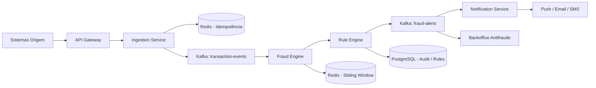
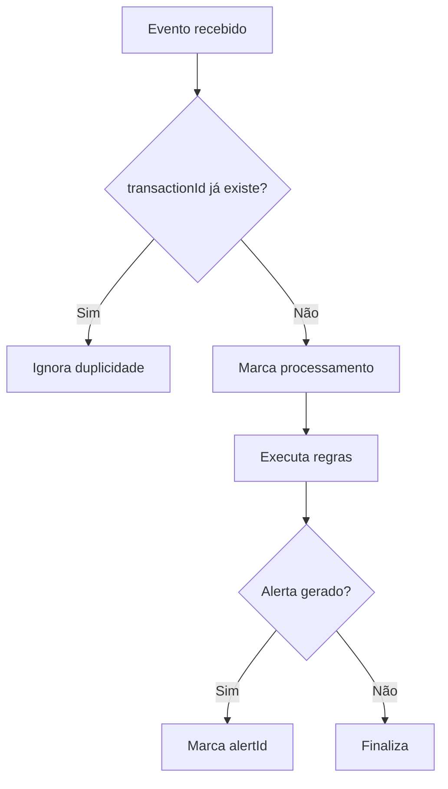
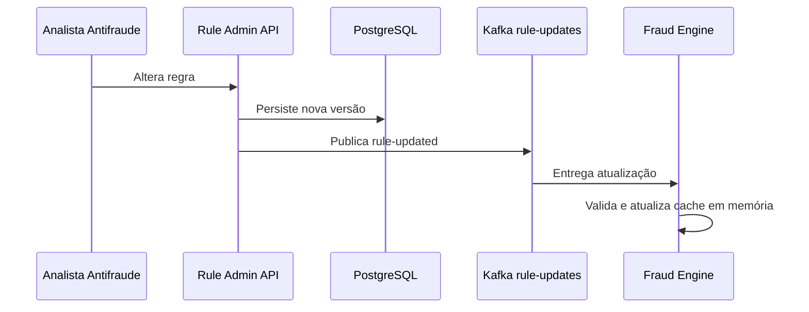
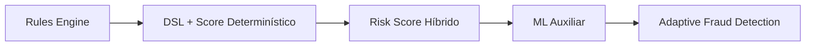

# Architecture — Motor de Detecção de Transações Suspeitas

## 1. Objetivo arquitetural

Projetar uma solução capaz de receber eventos de transações financeiras em tempo real, aplicar regras determinísticas configuráveis e gerar alertas internos e externos dentro do SLA de **500 ms ponta a ponta**.

A arquitetura prioriza:

- baixa latência;
- alta vazão;
- explicabilidade;
- idempotência;
- observabilidade;
- segurança;
- resiliência;
- evolução incremental.

## 2. Decisões principais

| Tema | Decisão |
|---|---|
| Estilo arquitetural | Event-Driven Architecture |
| Stack principal | Java 21 + Spring Boot 3 |
| Mensageria | Apache Kafka |
| Estado recente | Redis Cluster |
| Configuração e auditoria | PostgreSQL |
| Observabilidade | OpenTelemetry + Micrometer |
| Deploy | Docker + Kubernetes + Helm |
| Detecção V1 | Rules Engine determinístico |
| Consistência | At-least-once com effectively-once via idempotência |

## 3. Visão geral



## 4. Fluxo ponta a ponta

1. Um sistema origem envia uma transação via REST ou Kafka.
2. O `Ingestion Service` valida contrato, autenticação e idempotência.
3. A transação é publicada no tópico `transaction-events`.
4. O `Fraud Engine` consome eventos particionados por `accountId` ou `cardId`.
5. O `Rule Engine` executa regras determinísticas carregadas em memória.
6. Regras stateful consultam Redis para janelas deslizantes.
7. Se houver suspeita, um alerta é publicado em `fraud-alerts`.
8. O `Notification Service` envia alerta para cliente e canais internos.
9. A decisão é auditada com `traceId`, `transactionId`, `ruleId`, `ruleVersion` e `alertId`.

## 5. Componentes

### 5.1 Ingestion Service

Responsabilidades:

- receber transações;
- validar schema;
- autenticar origem;
- aplicar idempotência inicial;
- publicar evento no Kafka;
- responder rapidamente ao produtor.

Este serviço não executa regras antifraude. Ele mantém o caminho de ingestão magro e previsível.

### 5.2 Fraud Engine

Responsabilidades:

- consumir `transaction-events`;
- orquestrar execução de regras;
- consultar estado recente;
- produzir decisão;
- publicar alerta quando necessário.

### 5.3 Rule Engine

Responsabilidades:

- carregar regras ativas;
- manter regras em memória;
- avaliar condições;
- retornar regras disparadas;
- permitir atualização dinâmica sem redeploy.

### 5.4 Notification Service

Responsabilidades:

- consumir `fraud-alerts`;
- evitar notificação duplicada;
- integrar com push, email, SMS, CRM e backoffice;
- aplicar retry e DLQ em caso de falha.

### 5.5 Administration

Responsabilidades:

- cadastro de regras;
- versionamento;
- ativação/desativação;
- kill switch;
- auditoria administrativa.

## 6. Modelo de tópicos Kafka

| Tópico | Responsabilidade | Chave recomendada |
|---|---|---|
| `transaction-events` | Eventos de transações recebidas | `accountId` ou `cardId` |
| `fraud-alerts` | Alertas gerados pelo motor | `transactionId` |
| `rule-updates` | Propagação de alterações de regras | `ruleId` |
| `fraud-dlq` | Eventos não processados | `transactionId` |

## 7. Particionamento

O tópico de transações deve ser particionado por `accountId` ou `cardId` para preservar a ordem relativa de eventos do mesmo portador/cartão.

A quantidade inicial sugerida é **32 partições**, permitindo paralelismo horizontal do consumer group. A quantidade final deve ser definida por teste de carga, observando:

- throughput;
- consumer lag;
- tempo médio de processamento;
- skew de chaves;
- uso de CPU e memória.

## 8. Modelo de consistência

Kafka e integrações distribuídas operam naturalmente com entrega **at-least-once**.

Por isso, a solução não promete exatamente uma execução física. Ela garante **efeito exatamente uma vez** através de idempotência.



## 9. Sliding Window

Regras stateful utilizam Redis para manter estado recente.

Exemplos:

- número de transações nos últimos 2 minutos;
- valor acumulado nas últimas 24 horas;
- última localização conhecida;
- sequência de transações negadas;
- transações por MCC.

Estruturas sugeridas:

| Caso | Redis |
|---|---|
| Histórico temporal | Sorted Set |
| Idempotência | String com TTL via SET NX |
| Última localização | Hash |
| Contadores rápidos | String/Counter com TTL |

## 10. Regras dinâmicas

As regras são definidas por uma DSL controlada, evitando execução arbitrária de código.

Exemplo:

```json
{
  "ruleId": "HIGH_AMOUNT_AND_RECENT_TX",
  "version": 3,
  "enabled": true,
  "priority": 10,
  "severity": "HIGH",
  "when": {
    "all": [
      { "field": "amount", "operator": "GREATER_THAN", "value": 5000 },
      { "field": "txCountLast2Minutes", "operator": "GREATER_THAN_OR_EQUAL", "value": 3 }
    ]
  },
  "then": {
    "action": "GENERATE_ALERT"
  }
}
```

## 11. Atualização dinâmica de regras



Toda alteração deve registrar:

- autor;
- timestamp;
- motivo;
- versão anterior;
- versão nova;
- impacto esperado.

## 12. Estratégia de degradação

Nem toda falha deve derrubar o fluxo principal.

| Dependência | Estratégia |
|---|---|
| Redis indisponível | Executar regras stateless, marcar stateful como inconclusivas e enviar evento para reprocessamento. |
| PostgreSQL indisponível | Continuar usando snapshot de regras em memória. |
| Kafka indisponível | Retry com backoff; se falha persistir, acionar incidente crítico. |
| Notification indisponível | Enviar para DLQ/retry sem bloquear detecção. |
| Serviço de perfil indisponível | Usar dados disponíveis no evento ou fallback parametrizável. |

## 13. Segurança

- TLS/mTLS entre serviços.
- OAuth2/JWT para APIs administrativas.
- Pseudonimização de identificadores sensíveis.
- Criptografia em repouso com KMS.
- Logs sem PII.
- Segregação entre plano transacional e plano administrativo.

## 14. Observabilidade

### Métricas

- `transactions_received_total`
- `transactions_processed_total`
- `fraud_alerts_total`
- `rules_triggered_total`
- `rule_execution_time_seconds`
- `redis_latency_seconds`
- `kafka_consumer_lag`
- `notification_latency_seconds`
- `idempotency_duplicate_total`

### Logs estruturados

Campos mínimos:

- `traceId`
- `spanId`
- `transactionId`
- `accountHash`
- `ruleId`
- `ruleVersion`
- `alertId`
- `decision`
- `processingTimeMs`

### Tracing

OpenTelemetry deve propagar contexto entre REST, Kafka, Fraud Engine e Notification.

## 15. SLOs iniciais

| Indicador | Meta |
|---|---|
| Latência fim-a-fim | ≤ 500 ms |
| p95 interno do motor | < 100 ms |
| p99 interno do motor | < 200 ms |
| Disponibilidade | 99,95% |
| Duplicidade de alertas | 0 |
| Perda de eventos | 0 |

## 16. Trade-offs

### Por que regras antes de IA?

Regras determinísticas entregam:

- explicabilidade;
- auditabilidade;
- baixa latência;
- previsibilidade operacional;
- simplicidade de depuração.

A limitação é menor capacidade de detectar padrões inéditos. Por isso a arquitetura permite evolução futura para Risk Score e Machine Learning.

### Por que Kafka?

Kafka oferece desacoplamento, replay, particionamento e alta vazão. O trade-off é maior complexidade operacional, compensada por observabilidade, DLQ, idempotência e governança de tópicos.

## 17. Evolução


