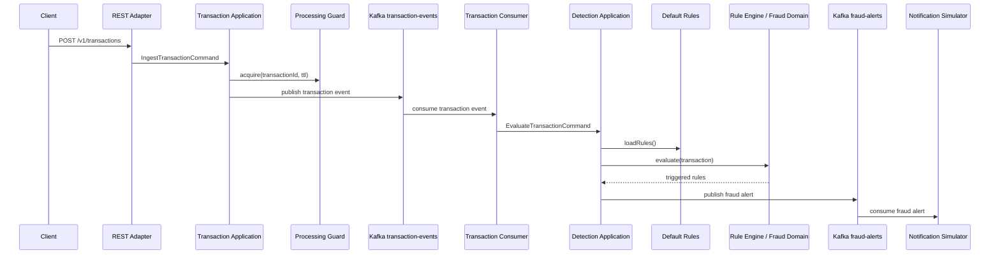

# MVP Flow

Este documento descreve o fluxo mínimo completo do case.

## Objetivo

Deixar a solução demonstrável de ponta a ponta, sem fingir que todos os componentes produtivos já existem.

O MVP cobre:

```text
REST → Kafka transaction-events → Fraud Detection → Kafka fraud-alerts → Notification simulator
```

## Fluxo implementado



## Regras do MVP

O MVP usa um `DefaultRuleProviderAdapter`, habilitado por feature flag.

Regras disponíveis:

- `HIGH_AMOUNT`: transação com valor maior ou igual ao limite configurado.
- `INTERNATIONAL_CARD_NOT_PRESENT`: transação internacional em canal card-not-present.

Configurações:

```yaml
fraud:
  rules:
    default-enabled: true
    home-country: BR
    high-amount:
      threshold: 5000.00
      currency: BRL
```

## Como executar localmente

Subir dependências:

```bash
make up
make kafka-topics
```

Rodar a aplicação no modo MVP:

```bash
make run-mvp
```

Flags usadas pelo `run-mvp`:

```bash
FRAUD_KAFKA_ENABLED=true
FRAUD_KAFKA_ALERT_PUBLISHER_ENABLED=true
FRAUD_KAFKA_ALERT_CONSUMER_ENABLED=true
FRAUD_RULES_DEFAULT_ENABLED=true
KAFKA_BOOTSTRAP_SERVERS=localhost:9092
```

## O que esse MVP prova

- A aplicação recebe transações por API REST.
- A entrada REST não executa a detecção no caminho síncrono.
- A transação é publicada em Kafka.
- Um consumer assíncrono executa a detecção.
- O domínio avalia regras determinísticas.
- Um alerta antifraude é criado quando uma regra dispara.
- O alerta é publicado em outro tópico Kafka.
- Um consumer simula entrega para canal interno/externo.

## Ponderações e evolução

### Rule Provider

No MVP as regras são fixas por configuração.

Evolução:

- persistir regras em PostgreSQL;
- criar Rule Admin API;
- versionar regras;
- permitir kill switch;
- publicar alterações em `rule-updates`.

### Idempotência

No MVP o guard ainda pode ser uma implementação simples.

Evolução:

- trocar para Redis com `SET NX EX`;
- compartilhar idempotência entre pods;
- aplicar TTL por janela operacional.

### Kafka e DLQ

No MVP o fluxo feliz está coberto.

Evolução:

- adicionar retry controlado;
- configurar DLQ;
- criar política de reprocessamento;
- medir consumer lag.

### Auditoria

No MVP o alerta é publicado em Kafka.

Evolução:

- persistir `fraud_alert_audit` em PostgreSQL;
- guardar regras acionadas, versão, severidade e timestamp;
- permitir rastreabilidade da decisão.

### Observabilidade

No MVP temos actuator e logs.

Evolução:

- métricas de throughput;
- latência de detecção;
- contagem de regras disparadas;
- tracing com OpenTelemetry;
- dashboard SRE.

### Performance

O MVP demonstra arquitetura e separação de responsabilidades.

Evolução:

- teste de carga com k6;
- tuning de partições Kafka;
- escala horizontal por consumer lag;
- validação de p95/p99.

## Frase para apresentação

> O MVP fecha a jornada básica de ponta a ponta. Ele não tenta simular toda a complexidade produtiva, mas prova a arquitetura central: ingestão desacoplada, decisão antifraude assíncrona, regras determinísticas explicáveis e publicação de alertas para canais consumidores. As evoluções ficam claras: Redis para idempotência distribuída, PostgreSQL para regras e auditoria, DLQ para resiliência e OpenTelemetry para observabilidade real.
